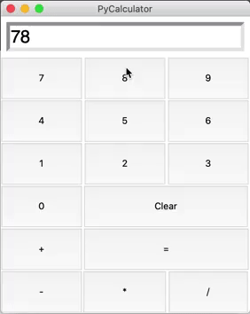
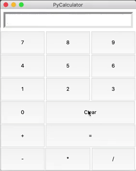

# PyCalculator
## Objective
Create a calculator app using Python‘s Tkinter library as for learning the basics of building a GUI with this very library.

## App Features
The app presents the four basic operations and also buttons to show the result and clear the display.:

The result of previous calculations can also be used for new ones:

